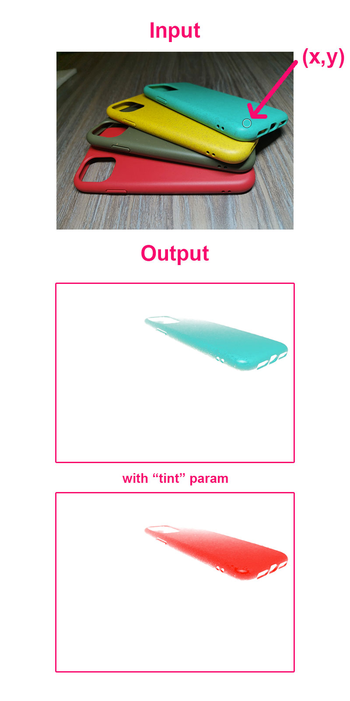

<!-- Generated by documentation.js. Update this documentation by updating the source code. -->

### Table of Contents

-   [PixelsSelector][1]
-   [getPixelInfo][2]
    -   [Parameters][3]
    -   [Examples][4]
-   [floodFill][5]
    -   [Parameters][6]
    -   [Examples][7]

## PixelsSelector

## getPixelInfo

Returns the values of a pixel of an image or canvas

### Parameters

-   `x` **[number][8]** x position.
-   `y` **[number][8]** y position.
-   `canvasImageSource` **([Image][9] | Canvas)** source image.

### Examples

```javascript
// returns {r:255,g:0,b:0,a:255,uint32:0xff0000ff}
PixelsSelector.getPixelInfo(4,4,canvas);
```

Returns **[object][10]** a object with props r,g,b,a,uint32

## floodFill

Returns an image fill from a starting point as the "magic wand" tool in photoshop

### Parameters

-   `pX` **[number][8]** x position.
-   `pY` **[number][8]** y position.
-   `canvasImageSource` **([Image][9] | Canvas)** source image.
-   `tolerance` **[number][8]** number (0-200).
-   `tintColor` **([string][11] \| [number][8])?** can be '#ff0000'(string) or 0xff0000(number) or 'ff0000'(string), if is null return pixel with original rgb values.

### Examples

```javascript
// returns ImageData {data: Uint8ClampedArray(1000000),width:500,height:500}
PixelsSelector.floodFill(5,5,canvas,100);
```

```javascript
// returns ImageData {data: Uint8ClampedArray(1000000),width:500,height:500}
PixelsSelector.floodFill(67,68,canvas,100,0xff0000);
```

```javascript
// returns ImageData {data: Uint8ClampedArray(1000000),width:500,height:500}
PixelsSelector.floodFill(67,68,canvas,100,'#ff0000');
```

Returns **ImageData** a ImageData Object with the same sizes of canvasImageSource



[1]: #pixelsselector

[2]: #getpixelinfo

[3]: #parameters

[4]: #examples

[5]: #floodfill

[6]: #parameters-1

[7]: #examples-1

[8]: https://developer.mozilla.org/docs/Web/JavaScript/Reference/Global_Objects/Number

[9]: https://developer.mozilla.org/docs/Web/API/HTMLImageElement/Image

[10]: https://developer.mozilla.org/docs/Web/JavaScript/Reference/Global_Objects/Object

[11]: https://developer.mozilla.org/docs/Web/JavaScript/Reference/Global_Objects/String
